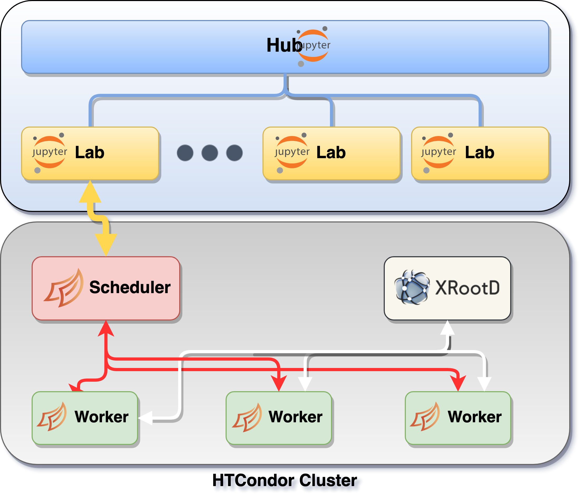

# Architecture

The current design, as depicted in the schema, has en environment where the users
can access and have a playground and a pool of resources in a cluster.

In detail, the users can access through a JupyterHub portal and have a personale
JupyterLab instance where they can work. The resources are in one or more HTCondor clusters
that are managed using the [Dask](https://dask.org/) framework. The data related
interaction is consumed by the [XRootD](https://xrootd.slac.stanford.edu/) service.

## Components

Summarizing all the resources and pieces needed to construct the described architecture,
we have the following components:

- A **[k8s](https://kubernetes.io/) cluster** where the JupyterHub and JupyterLabs are managed
- Several **HTCondor central components** to manage the pool of jobs
- A custom derived plugin for **Dask jobqueue**: [repository](https://github.com/comp-dev-cms-ita/dask-remote-jobqueue)
- A custom **Dask labextension** to support the end-users transparently: [repository](https://github.com/comp-dev-cms-ita/dask-labextension)
- A **forwarder service** for the cluster connections
- A **controller service** to interact with che Dask Scheduler inside the cluster