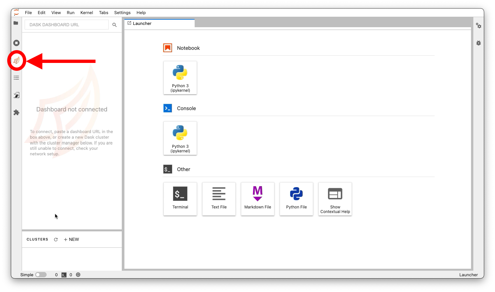
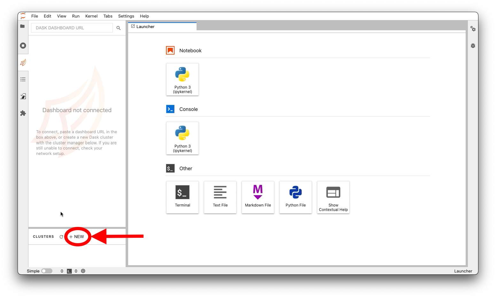
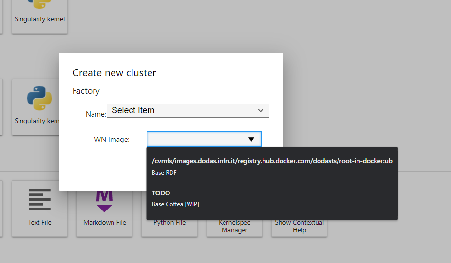
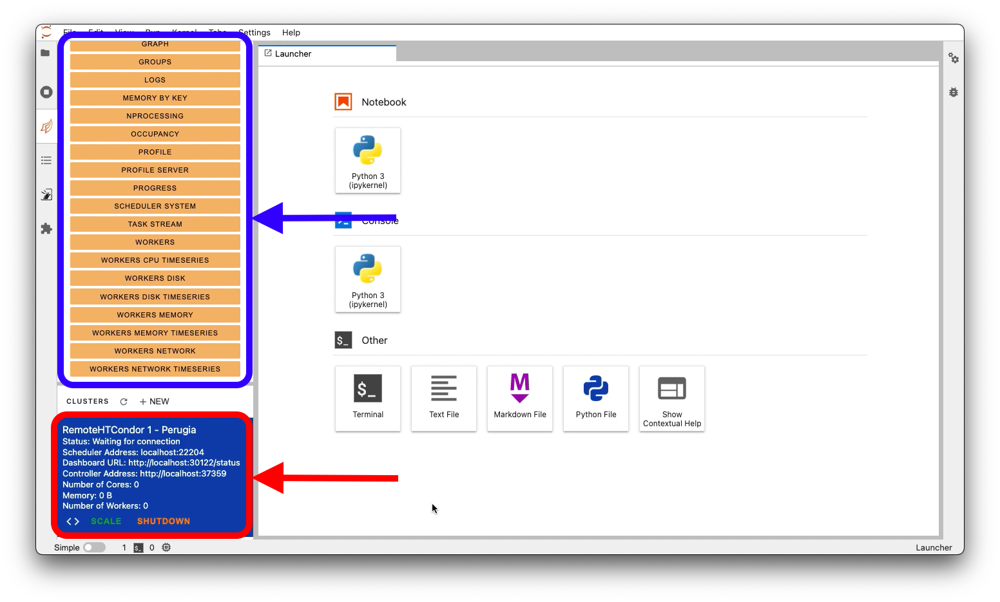

# :rocket: How to start

## :gear: Create a cluster

To create a Dask cluster from Jupyter Lab you have to use the Dask Lab Extension.
You can find it on the left sidebar as shown in the figure:



Then, you can click on the `NEW` button of the Dask Lab Extension:



You must select a proper factory name and worker node image from the available list and, once selected,
you can press the `Create` button:



After a couple of minutes, you will see the created cluster in the cluster list,
indicated in the image by the red square. If you select that cluster, you will see
also a list of available fields to monitor and inspect the cluster, the blue square
in the image. The Dask Lab Extension will select automatically for you the first
cluster created, as a consequence, you should see also all the fields available in
the dashboard (blue square).



!!! info

    in the `Status` field, you will see the actual state of the
    cluster creation. The cluster will be ready when the state is `Running`.
    In that situation, there will be a valid Scheduler address and Dashboard URL:
    e.g. `localhost:12345`. During the creation, you could see `Status` like `Job is idle`
    or `Waiting for connection`. In case of error, the `Status` will show the
    reason for the issue.

!!! attention

    it is not necessary to click on `Dashboard URL`, because the link
    is not directly available outside the Dask Lab Extension. To select a cluster,
    you just have to move the cursor in the item and click when the cursor become a
    hand.
## :material-connection: Connect to the cluster

Now, you can connect to the cluster using a `Dask Client`. Open your notebook,
select the cell where you want to put the client connection code, and click
the `Inject Code` button (red circle). Then, you will see the code in your cell,
as shown in the following image with the green square:


!!! tip

    you can also write that code copying the proper scheduler address
    shown in the cluster `Scheduler Address`, for example:

    ```python
    from dask.distributed import Client

    client = Client("localhost:12345")
    ```
