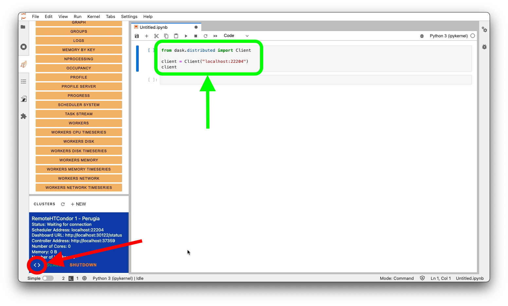

<!--
 Copyright 2021 dciangot
 
 Licensed under the Apache License, Version 2.0 (the "License");
 you may not use this file except in compliance with the License.
 You may obtain a copy of the License at
 
     http://www.apache.org/licenses/LICENSE-2.0
 
 Unless required by applicable law or agreed to in writing, software
 distributed under the License is distributed on an "AS IS" BASIS,
 WITHOUT WARRANTIES OR CONDITIONS OF ANY KIND, either express or implied.
 See the License for the specific language governing permissions and
 limitations under the License.
-->

# Hot to start

## Create a cluster

To create a Dask cluster from Jupyter Lab you have to use the Dask Lab Extension.
You can find it on the left sidebar as shown in the figure:


Then, you can click on the `NEW` button of the Dask Lab Extension:


You must select a proper factory name from the available list and, once selected,
you can press the `Create` button:


After a couple of minutes, you will see the created cluster in the cluster list,
indicated in the image by the red square. If you select that cluster, you will see
also a list of available fields to monitor and inspect the cluster, the blue square
in the image. The Dask Lab Extension will select automatically for you the first
cluster created, as a consequence, you should see also all the fields available in
the dashboard (blue square).


> **NOTEs**: in the `Scheduler Address` field you will see the actual status of the
> cluster creation. The cluster will be ready when there is present a valid
> cluster address such as `localhost:12345`.
>
> **NOTE**: it is not necessary to click on `Dashboard URL`, because the link
> is not directly available outside the Dask Lab Extension. To select a cluster,
> you just have to move the cursor in the item and click when the cursor become a
> hand.

## Connect to the cluster

Now, you can connect to the cluster using a `Dask Client`. Open your notebook,
select the cell where you want to put the client connection code, and click
the `Inject Code` button (red circle). Then, you will see the code in your cell,
as shown in the following image with the green square:



> **NOTE**: you can also write that code copying the proper scheduler address
> shown in the cluster `Scheduler Address`, for example:
> 
> ```python
> from dask.distributed import Client
> 
> client = Client("localhost:12345")
> ```
