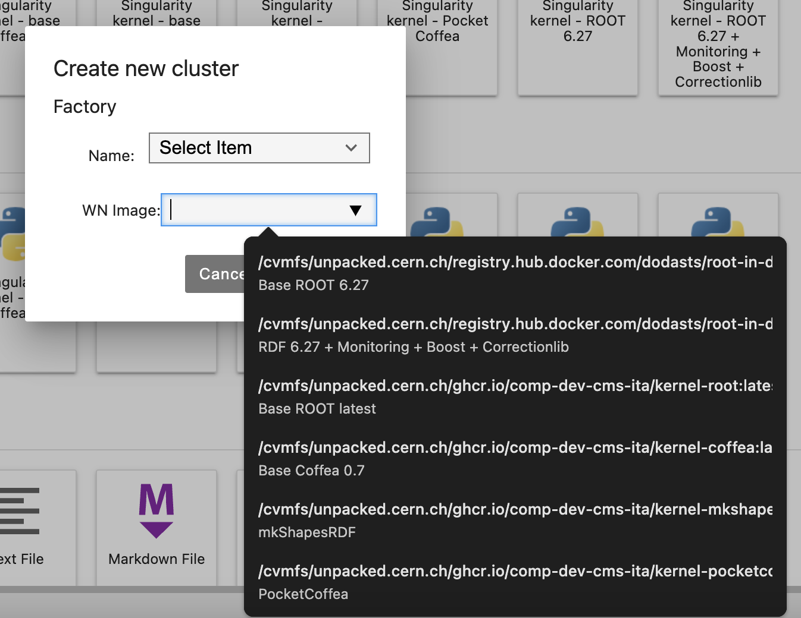
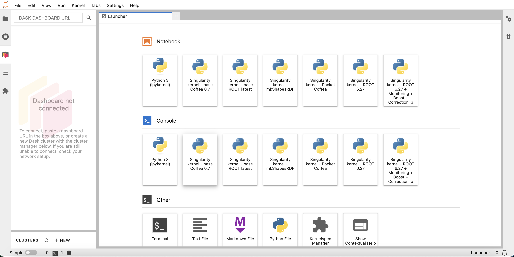
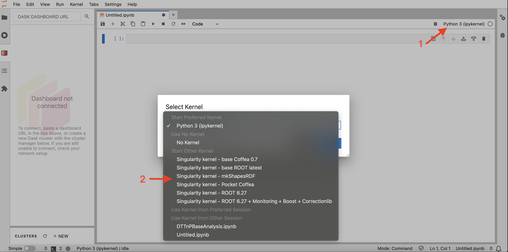

# Frameworks available on the Facility

Some HEP frameworks are currently available (as singularity images) to be used on the facility. 

> :warning: More frameworks will be added in the future!

The base framework images are:
- ROOT (latest version available on Conda)
- Coffea (version `v0.7.22`)

Starting from those images, the following frameworks are also available:
- [mkShapesRDF](https://gitlab.cern.ch/cms-analysis/general/mkShapesRDF) (depeding on the ROOT base image)
- [PocketCoffea](https://gitlab.cern.ch/cms-analysis/general/PocketCoffea) (depending on the Coffea base image)

> :exclamation: These features are available from the `ghcr.io/comp-dev-cms-ita/jupyterlab:AF20-alma9-v0.0.8` Jupyter Lab image version onwards.
## How to use them

### Creating the DASK cluster
To create the DASK cluster, follow the instructions reported [here](https://infn-cms-analysisfacility.readthedocs.io/en/latest/tutorials/dask/dask_init/) and select the WN image from the dropdown window, as shown below:

### Loading a notebook kernel
The same image can also be used for the notebook kernel, by clicking on the desired button in the JupyterLab home page:

or, alternatively, opening a notebook and selecting the kernel afterwards:

